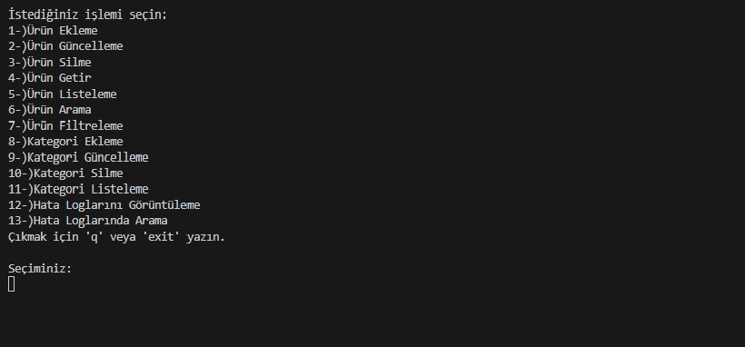
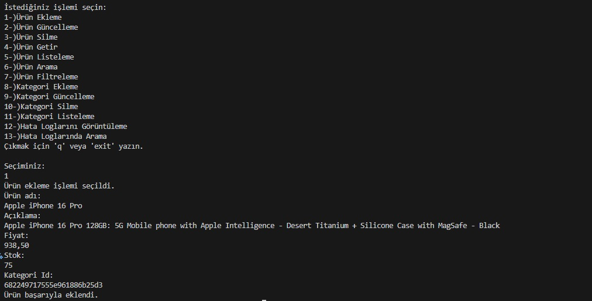
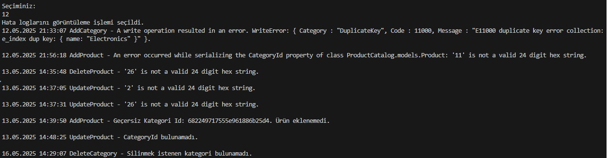

# Product Catalog Console Uygulaması

## 📦 Proje Açıklaması

Bu proje, konsol tabanlı bir **Ürün Katalog Yönetim Sistemi**'dir. Kullanıcılar ürünleri ve kategorileri yönetebilir, ürün filtreleme, sayfalama, güncelleme, silme gibi işlemleri gerçekleştirebilir. Ayrıca hata yönetimi için basit bir loglama sistemi de entegre edilmiştir.

Uygulama, gerçek veritabanı olarak **MongoDB** kullanır ve tüm işlemler kalıcı olarak veritabanına yazılır. Hatalar bir `.txt` dosyasına kaydedilir ve filtrelenebilir.

## ⚙️ Kullanılan Teknolojiler

- [.NET Core 9.0](https://dotnet.microsoft.com/en-us/)
- [MongoDB](https://www.mongodb.com/)
- C# Console Application
- Repository Pattern
- Plaintext Loglama

## 🔧 Özellikler

- ✅ Kategori ekleme, silme, güncelleme, listeleme
- ✅ Ürün ekleme, silme, güncelleme, listeleme
- ✅ Ürün filtreleme (fiyat ve kategori bazlı)
- ✅ Ürünleri sayfa bazlı getirme (pagination)
- ✅ Hataları `.txt` dosyasına loglama
- ✅ Tarih ve anahtar kelimeye göre log filtreleme

## 🚀 Kurulum

1. **MongoDB**'yi kurun ve çalışır durumda olduğundan emin olun.
2. Projeyi Visual Studio / VS Code ile açın.
3. `appsettings.json` içinde Mongo bağlantı ayarlarını yapılandırın.
4. Projeyi çalıştırın.

## 📸 Ekran Görüntüleri
### Main-Menu

### Ürün-Ekleme

### Log-Kayıtları

